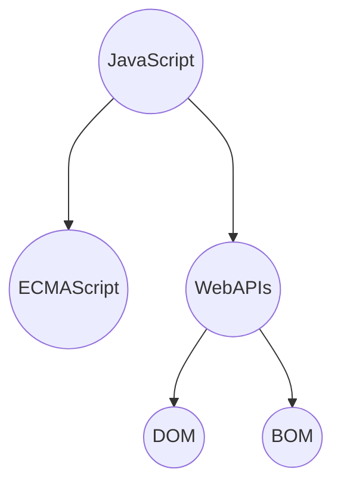

# JavaScript基础

## 1.介绍

作用：网页特效（监听用户行为使得网页进行反馈）、表单验证（针对表单数据的合法性进行判断）、数据交互（获取后台数据渲染）、服务端编程（node.js)

组成：ECMAScript语法规范、WebAPIs（DOM——页面文档对象模型，BOM——浏览器对象模型）



---

### 1.1引入方式

JavaScript程序不能独立运行，它需要被嵌入HTML中，浏览器才能执行JavaScript代码，通过标签 `script`将JavaScript引入HTML中。

---

#### 1.1.1内部方式

直接写在HTML文件里，用 `script`标签包住，规范：`script`标签写在 `<body>`内部 `</body>`

将 `<script>` 放在HTML文件底部原因是浏览器会按照代码在文件中的顺序加载HTML，如果先加载的JavaScript期望修改其下方的HTML，那么它可能由于尚未加载而失效。

---

#### 1.1.2外部方式

代码写在以.js结尾的文件里，通过 `<script></script>` 标签引入HTML页面当中

```html
<body>
    <script src="my.js"></script>
</body>
```

script标签中间无需写代码，否则会被忽略，外部JavaScript文件会使代码更加有序，更易于复用，无脚本混合，HTML更易读

---

#### 1.1.3内联方式

代码写在标签内部，Vue常用

示例：

```html
<body>
    <button onclick="alert()">提示</button>
</body>
```

---

### 1.2注释写法

单行：//

块注释：/*  */

结束符：；   可写可不写

---

### 1.3输入输出语法

输出语法：

示例1：

`document.write('要输出的内容') 、`

向body内输出内容，如果输出的内容是标签，也会解析成网页元素

`document.write('我是div标签')`

`document.write('<h1>我是标题</h1>')`

示例2：

`alert('要输出的内容')`

页面弹出警告对话框

示例3：

`console.log('控制台打印')`

控制台输出语法，用于调试

输入语法：

`prompt('请输入您的姓名')`

显示一个对话框，对话框中包含一天文字信息，用来提示用户输入

JavaScript代码执行顺序：

按HTML文档流顺序执行JavaScript代码；alert()和prompt()会跳过页面渲染先被执行。

---

### 1.4 字面量

在计算机中描述事物

---

## 2.变量

计算机存储数据的容器

注意：const优先，const语义化更好

基本数据类型若发生改变则不能用const用 let，但引用数据类型内部发生改变可以用const，因为引用数据类型变量中存储的仅仅是实例化对象的地址，实例化对象结构数据发生变化，但地址不会发生改变

建议数组和对象都使用const声明

示例：以下语法错误，因为地址不同

```javascript
const arr=[]
arr=[1,2,3]
const obj ={}
obj={
 name: ''
}
```

但可以改为以下方式

```javascript
const arr=[]
arr[0]=1
arr[1]=2
const obj={}
obj.name=''
```

---

### 2.1变量的使用

声明：

`let 变量名`

声明关键字   变量名（标识符）

赋值：

变量名=数值

初始化：声明变量同时完成赋值操作

注：let不允许多次声明一个变量，但var可以；临时变量不用自动销毁

---

### 2.2 变量的本质和命名规则规范

本质：程序在内存中申请的一小块用来存放数据的小空间

规则：不能有关键字，只用下划线、字母、数字、$组成，且数字不能开头，字母严格区分大小写

规范：名称要有意义，建议小驼峰命名法：第一个单词首字母小写，后面每个单词首字母大写，如：userName

---

### 2.3 变量声明关键字let和var的区别

在较旧的JavaScript中，使用关键字var来声明变量，而不是let，var在现在的开发中一般不再使用；

let解决了var的一些不合理问题：

var可以先使用再声明，var声明过的变量可以重复声明，var在变量提升、全局变量、没有块级作用域等问题

---

### 2.4 数组

声明：

`let 数组名=[数据1,数据2,...,数据n]`

数组可以存储任意类型的数据

取值语法：

`数组名[下标] `

增添：

```javascript
arr.push(元素1,元素2,...,元素n)//将一个或多个元素添加到数组的末尾，并返回数组的新长度
arr.unshift(内容)//将一个或多个元素添加到数组的开头，并返回该数组的长度
```

删除：

```javascript
arr.pop()//从数组中删除最后一个元素，并返回该元素值
arr.shift()//从数组中删除第一个元素，并返回该元素值
arr.splice(start,deleteCount)//删除指定元素，deleteCount缺省为从指定删除到最后
```

---

## **3. 常量**

使用const声明的变量为常量

当某个变量永远不会改变时用const声明而非let

命名规范与变量保持一致

`const 常量名=数值`

常量不允许重新赋值,声明时必须初始化

---

## 4.数据类型

### 4.1 基本数据类型

#### 4.1.1 number 数字型

JavaScript中的正数、负数、小数等数字统一称为数字型

JavaScript 是若数据类型，变量到底属于哪种类型只有赋值后才能确认，而Java是强数据类型。

NaN代表一个计算错误，任何对NaN的操作都会返回NaN

#### 4.1.2 string 字符串型

通过单引号（' '）、双引号（""）或反引号（`）包裹的数据都是字符串

单引号双引号可以互相嵌套，但是不可以自己嵌套自己，外双内单或外单内双；

必要时可以使用转义符\，输出单引号或双引号

字符串拼接：+运算符可以实现字符串的拼接

模板字符串：拼接字符串和变量

`` 反引号，内容拼接变量时，用${ }包住变量

```javascript
let age=18
document.write(`我今年18岁了`)
document.write(`我今年${age}岁了`)
//两者相同
```

#### 4.1.3 boolean 布尔型

两取值true和false

#### 4.1.4 undefined 未定义型

未定义只有一个值undefined。只声明变量，不赋值的情况下，变量默认值为undefined。

使用场景：声明变量等待传送数据，通过检测此变量是否是undefined，判断是否有数据传送。

#### 4.1.5 null 空类型

代表“无”、“空”特殊值

undefined表示没赋值，null表示赋值了，内容为空

使用场景：把null作为尚未创建的对象

```javascript
console.log(undefined+1)//NaN
console.log(null+1)//1
```

null：空对象；`null === let obj={}`

#### 4.1.6 检测数据类型

1、使用控制台输出

```javascript
let age=18
let name='刘'
let flag=false
let buy
console.log(age,name,flag,buy)
```

2、通过typeof关键字检测

typeof运算符可以返回被检测的数据类型

作为运算符使用：`typeof x `  函数形式：`typeof(x)`

---

### 4.2 引用数据类型

复杂数据类型，在存储变量时仅存储地址，通过new创建的对象object 对象、Array、Date等

栈中存放简单数据类型、堆中存放复杂数据类型

引用类型的变量（栈）里存放的是地址，真正的对象实例存放在堆中

## 5. 类型转换

prompt、表单的数据类型默认字符串值

### 5.1 隐式转换

某些运算符被执行时，系统内部自动将数据类型进行转换，此为隐式转换。

规则：+两边只要有一个是字符串，都会把另一个转换成字符串

除了+以外的运算符，其他都会把数据转换成数字类型

+号作为正号后跟数据可以转换成数字型

注意：1、有字符串的加法""+1，结果为"1"

2、减法只能用于数字，会使空字符串转换成0

3、null经过数字转换后变为0

4、undefined经过数字转换后变成NaN

### 5.2 显示转换

Number(数据)

转换成数字类型，若字符串内有非数字，转换失败则结果为NaN；NaN也是number类数据，代表非数字

parseInt(数据)：只保留整数

parseFloat(数据)：可以保留小数

运算符：比较运算符有隐式转换，最终会把数据隐式转换成number类型再比较，==只判断值是否一样，===判断值和类型是否都一样，全等

NaN不可进行运算，包括比较运算符，涉及到NaN的比较都是false

注意：''、0、undefined、null、false、NaN布尔值均为false，其余为true

---

## 6.函数

### 6.1 函数基本使用

函数声明：

```javascript
function 函数名(参数列表){
   函数体
}
```

命名规范：和变量名规范基本一致，尽量小驼峰命名，前缀应为动词

调用：`函数名(传递的参数列表)`

如果不输入实参，则默认undefined，可以加默认值

注意：函数名相同，后面覆盖前面；

实参多于形参，剩余的实参不参与运算，实参少于形参，剩下形参默认值或undefined（函数内部有arguments承载所有实参）；

如果函数内部未声明一个变量而是直接使用此变量直接赋值，则当全局变量使用，函数内部的形参是局部变量。

同名变量访问原则：能够访问到的情况下，先局部，再全局（自底向上层层递进访问——就近原则）

### 6.2 匿名函数

具名函数：其调用可以写在任何位置

声明：function fn(){}，调用：fn()

匿名函数：function(){}

匿名函数由于无名，无法直接使用

函数表达式：将匿名函数赋值给一个变量，且通过变量名称进行调用

示例：

`let fn=function(){//函数体}`调用只能在声明之后

立即执行函数：避免全局变量之间的污染

```javascript
(function(形参列表) { console.log(11) })(实参值列表);
(function(形参列表) { console.log(11) }(实参值列表));
```

立即执行函数之间使用；隔开

---

## 7.逻辑中断

```javascript
function getSum(x,y){
     x=x||0
     y=y||0
     console.log(x+y)
}
getSum(1,2)
```

类似参数的默认值写法

逻辑运算符里的短路：只存在于&&与||中，当前者左边逻辑值为false时，右边不执行；当后者左边逻辑值为true时，右边不执行

&&若前后都是真，则返回最后一个真值，||输出第一个真值

无论&&还是||，运算结果都是最后被执行的表达式的值，一般用于变量赋值

---

## 8.对象

object=属性+方法

声明：

`let 对象名={} ` 或者 ` let 对象名 = new Object()`

属性：信息特征；属性成对存在，包括属性名和值，之间用 `:`分割；多个属性之间用 `,`分割；属性就是依附在对象上的变量；属性名可以加""或者''

方法：功能行为

```javascript
let 对象名 = {
    属性名:属性值
    方法名:函数
}
```

查询：`对象.属性`

`对象名['属性名']`

```javascript
let obj{
   'obj-name':'name'
}
obj['obj-name']
```

赋值：`对象.属性=值`

添加：`对象名.新属性名=值`

删除：`delete 对象名.属性名`

方法：方法名和函数两部分组成，使用:分割

多个属性之间使用,分割

方法是依附在对象中的函数

方法名可以加""或者''

```javascript
let person = {  
	name: 'zhang',  
	方法名: function(){  
	//函数体  
	}
}
```

方法调用：`对象名.方法名()`

对象遍历：

```javascript
let arr=[1,2,3]
for(let k in arr){
//k为索引号，字符串型
   arr[k]
}
//不推荐遍历数组，推荐用来遍历对象
let obj={
   uname='zhang',
   age=18
}
for(let key in obj){
   //k为属性名 'uname','age'
   obj[key]
}
```

for in语法中的key是一个变量，在循环过程中依次代表对象的属性名，必须要 `[]`解析

内置对象：

JavaScript内部提供的对象，包括各种属性和方法供使用

例：Math内置对象

random：生成0-1随机数（不包括0和1）；cell：向上取整；floor：向下取整；max：最大数；min：最小数；pow：幂函数；abs：绝对值

---

---

# Web APIs

作用：使用JavaScript操作HTML和浏览器，分为DOM文档对象模型和BOM浏览器对象模型

## 1.DOM

DOM：Document Object Model——文档对象模型，是用来呈现以及与任意HTML或XML文档交互的API

DOM树：将HTML文档以树状结构直观的表现

DOM对象：浏览器根据HTML标签生成的js对象

### 1.1获取元素

### 1.2事件基础

### 1.3事件进阶

### 1.4节点操作

## 2.BOM

### 2.1操作浏览器

### 2.2正则表达式
